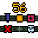
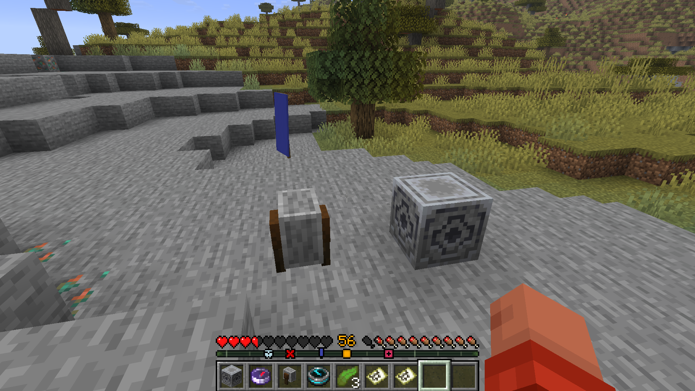

# Explorer Locator Bar

Adds various waypoints to the player Locator Bar:
- From Compass, Lodestone Compass, Recovery Compass
- From Points of Interest on Maps (including Banners)



## Compasses

Compasses magnetized to Lodestone, show their Lodestone target as a waypoint on locator bar.

Easily changing lodestone waypoint colors:
- using the compass multiple times on a lodestone, will "randomly" cycles through different colors
- only works if the mod is also installed server-side (optional)

Demagnetize a lodestone compass using a grindstone:
- only works if the mod is also installed server-side (optional)

Regular (non-lodestone) compasses show the spawn point on the locator bar.


Recovery Compasses show the player's last death position on the locator bar.

Lodestone Compass naming :
- if the compass has an RGB code in its name (for example, a compass named "Home #00FF8F"), or a § code in its name, it will use that color for the waypoint.
 Otherwise, the color is randomly determined based on the coordinates of the lodestone.
- the names of compasses (minus any RGB codes) can be shown above the bar by holding down the player list key (by default TAB)

## Maps & PoI

Display map's points of interest as waypoints on the locator bar:
- when holding a filled map
- banners on maps only appear as waypoints if the mod is also installed server-side (optional)


## Locator Bar Information

Optionally adds a compass dial to the locator bar: 
- showing cardinal directions (north ↑, south ↓, west ←, east →)
- showing divisions to estimate angles in between (number of divisions configurable)
- displayed when the player has a compass (even if not linked to a lodestone) or a recovery compass


Display the distance to the waypoint the player is aiming at:
- only visible if aimed within +/-10° angle
- using the waypoint color
- when shown, the experience level is hidden
- working for standard entity waypoints and lodestone waypoints


Only consider compasses and maps held by the player within a configurable location:
- whole inventory (default),
- hotbar only,
- hands only.

Checks bundles, so you can place all of your compasses or maps in a bundle, and it will still work.

## Other

Clock held by player chimes at night time:
- location configurable (never by default)
  - inside bundles included (if enabled by config)
- it plays a chime sound (configurable) at the end of every day
- only works in overworld (when the clock itself works)

## Configuration

All features of this mod can be configured. The configuration file format is formated as follows (default values shown):
```json
{
  "tab_forces_locator_bar": true,
  "tab_shows_names": true,
  "holding_location": "inventory",
  "holding_bundles": true,
  "dial_resolution": 0,
  "show_recovery_compasses": true,
  "show_spawn": false,
  "show_maps": false,
  "show_distance": "never",
  "show_in_spectator": false,
  "colors": {
    "lodestone_color": "random",
    "recovery_color": "bce0eb",
    "spawn_color": "6bcf6d",
    "dial_color": "879e7b",
    "color_customization": true
  },
  "clock_location": "never",
  "clock_sound": {
    "sound_id": "minecraft:block.note_block.chime"
  }
}
```

An interactive configuration screen is available when  ModMenu and Clothconfig are present:


## Acknowledgements
This project was inspired by and builds upon the work of:
- [Locator Lodestone](https://modrinth.com/mod/locator_lodestones)

Special thanks to the authors and contributors of these projects.